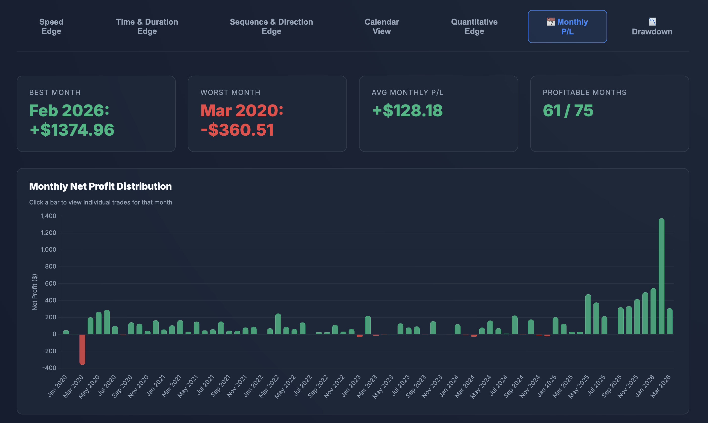
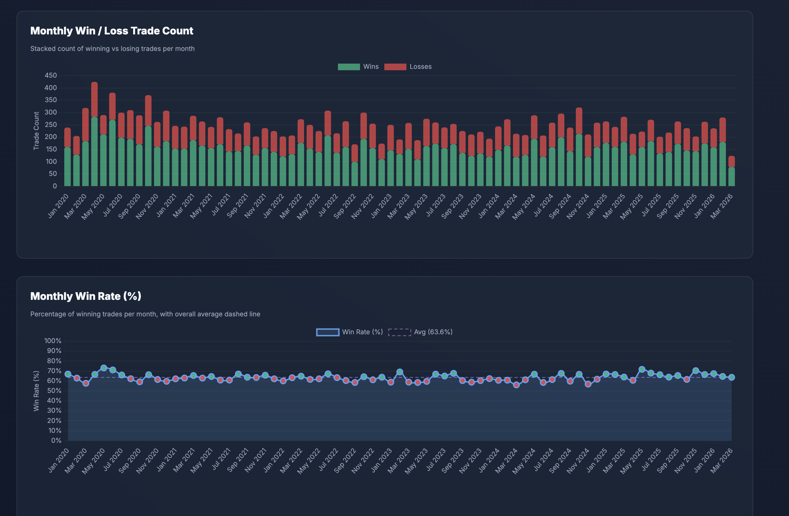

# 🏦 Bands Sweeps EA — Smart Money Meets Algorithmic Precision

> **MQL5 Expert Advisor for MetaTrader 5** | Multi-Timeframe | XAUUSD Optimized | v8.0

---

## 🧠 What Is This?

**Bands Sweeps EA** is a sophisticated, fully-automated trading bot that fuses **Smart Money Concepts (SMC)** with classical technical indicators into a single highly-defensive, high-probability strategy. It hunts for liquidity sweeps at key institutional levels, confirms context across three timeframes, and enters only when multiple filters align — making poor-quality setups virtually impossible to trade.

---

## ⚡ Core Strategy

The entry pipeline runs through three layers of confluence, all of which must agree before a single order is placed:

| Layer | Timeframe | Role |
|-------|-----------|------|
| **Macro Context** | H1 | Trend bias via ADX + RSI-Adaptive entry zones |
| **Mid-Level Zoning** | M5 | Bollinger Band extremes + Fibonacci Premium/Discount |
| **Micro Execution** | M1 | Liquidity sweep detection + structural clearance + entry timing |

### 🔑 Standout Features

- **Internal Liquidity Scanner** — Real-time mapping of swing highs/lows, Equal Highs/Lows (EQH/EQL), and major fractals. Entries are *only* valid after a confirmed liquidity sweep.
- **RSI-Adaptive Entry Zones** — The permitted entry zone near H1 Bollinger Band extremes dynamically expands or contracts based on RSI momentum, avoiding entries against strong momentum.
- **Multi-TF Volatility Squeeze Filter** — Detects BB squeezes across M1, M5, and H1 independently. Blocks new entries and can close open trades when dangerous compression is detected.
- **Deep Sweep Requirement** — Major/EQ liquidity levels require a deeper, atr-qualified pierce before they qualify as a valid entry trigger.
- **High-Impact News Filter** — Built-in MQL5 economic calendar integration avoids trades within a configurable window around major events.
- **Entry Deceleration Mode** — Instead of entering on the candle open, the bot waits for tick-speed to peak and decelerate, timing entries at the point of exhaustion.

### 🛡️ Trade Management

- **BOS Risk Manager** — Tracks the structural extreme of the entry. If price breaks and retests that level against the position, the trade is exited early.
- **Momentum Hold Mode** — On spike entries with strong follow-through, the bot bypasses the standard TP and rides toward the opposite Bollinger Band extreme.
- **Slow Crawl Exit** — Cuts trades that grind slowly against the position via consecutive adverse EMA slopes.
- **Dynamic ATR-Based SL** — All risk parameters (SL, squeeze detection, sweep depth, BOS buffers) scale with current volatility — no fixed pip values.

---

## 📊 6-Year Backtest Results — XAUUSD (2020–2026)

### Equity Curve

XAUUSD_2020_2026.png)

---

### Monthly Profit Distribution



---

### Monthly Win Rate & Drawdown Distribution



---

## 🏗️ Architecture Highlights

```
OnTick()
├── UpdateIndicatorBuffers()     — M1/M5/H1 BB, ATR, ADX, RSI
├── ScanInternalLiquidity()      — Fractal scanner & EQH/EQL clustering
├── EvaluateDashboardStates()    — Full state matrix (trend, zones, squeeze, news)
├── ManageOpenTrades()           — BOS, Momentum Hold, Crawl, Mean-Loss exits
├── CheckEntry()                 — Full confluence gate before order placement
└── DrawDashboard()              — Real-time on-chart panel
```

- Written in **MQL5** (~3,600 lines), event-driven and fully modular
- Runs natively in **MetaTrader 5** — no external dependencies
- ATR-normalized across all logic layers for robust adaptability to any volatility regime

---

## ⚙️ Key Input Groups

| Section | What It Controls |
|---------|-----------------|
| Entry Timing | Immediate / Deceleration / Directional Stop modes |
| H1 RSI-Adaptive Zone | Dynamic expansion of entry zone based on momentum |
| Squeeze Filter | M1/M5/H1 independent squeeze detection & response |
| SMC Liquidity | Swing lookback, EQ clustering tolerance, deep sweep ATR |
| Trade Management | BOS confirmation, momentum hold, crawl exit, mean-loss exit |
| News Filter | Minutes before/after high-impact events to halt trading |
| Trading Hours | Server-hour blocklist (e.g. low-liquidity Asian open) |

---

## 📁 Repo Structure

```
Bands_sweeps_EA/
├── bands_swweps.mq5        # Main Expert Advisor source
├── bot_specs.md            # Strategy & architecture documentation
├── optimizer/              # Optimization configs & results
├── backtests/              # Backtest reports
└── demo_4d_chart.html      # 4D chart visualization tool
```

---

*Built with MQL5 for MetaTrader 5. Backtested on XAUUSD M1 (2020–2026).*
